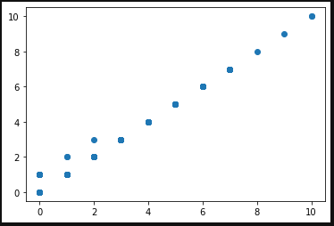

# HW_8

머신러닝 과제 입니다.

[Barcelona data sets](https://www.kaggle.com/xvivancos/barcelona-data-sets)

# 문제를 해결하기 전에 해야할 것

자신의 파일 사용 권한 문제 자신만 사용으로 변경

```text
0. Make your home(~) directory to be private
	- Use 'chmod'
		- (ex) chmod 770 /home/ID/
	- Change your password
```

# 내가 사용할 데이터

```text
(3) Dataset URL: https://www.kaggle.com/xvivancos/barcelona-data-sets
		Files: [accidents_2017.csv]
		Label: Victims  # regression
```

# 코드 작성 방법

```text
2. How to submit?
	- Make a new directory for this homework
		- (ex)  /home/ID/homework8/
	- Download the data of your problem to the new directory
	- Implement your code(python3.x) in the directory
	- Code file name must be 'code.py'
		- (ex)  /home/ID/homework8/code.py
```

PATH : /home/ID/homework8/

경로에 폴더 생성

코드 제출경로

PATH :  /home/ID/homework8/code.py

에 제출

# 코드 마감

```text
3. Due:  June 12일(Friday) 23:59
	- CAUTION: do NOT modify your code file after the due.
	- If violate this, then you may get 0 score.
```

# 과제 필수 사항

4. Grading basis (Total score: 25)
	- Note that this is at least two times greater than previous homework
	- There are THREE criteria

	- [Criteria 1] (10 points) Does it work?   
		- It has to show performance (accuracy or MAE) of every fold
		- (ex) /home/ID/homework8$  python3 code.py
			.....
			fold 1: accuracy = 0.8
			....
			....
			fold 2: accuracy = 0.7
			....
			....
			Total (Average) accuracy = 0.78
		- CAUTION: If you used Jupyter, then you need to change it to 'code.py'
			- If no python code but only Jupyter, you get 0~5 points
		- CAUTION: Runtime of the code must be shorter than 3 minutes
			- You can save your trained models using 'pickle', and load the model for each fold

	- [Criteria 2] (5 points) Did you use allowed modules or packages?
		- CAUTION: You have to use "sklearn", "numpy", "pandas", "pickle", ...
		- Do not use any other module and packages
		- If you are not sure a particular package is okay, then ask your professor before use it

	- [Criteria 3] (10 points) You need to explain the following items as comments in your code
	
0. Problem (1 points) : 3~4 lines
	- Definition of Input, Output
	- Is it a classificaiton? regression?
	- How many number of labels?
	- How the data looks like?
1. Feature (1 points) : 3~4 lines
	- You can choose or define features by yourself
	- How did you preprocess the data?
2. Model (2 points) : 3~4 lines
	- You have to use one of the following list
	- Why did you choose your models?
	- Model list: Linear regression, Ridge regression, Lasso regression, Logistic regression, Support Vector Machine(SVM or SVC), Support Vector Regression, Random Forest, Gaussian naive bayes, Multilayer perceptron, Decision Tree 
3. Measure (2 points) : 3~4 lines
	- Explain the steps of measurement
	- 10-fold cross validation 
	- Classification: "weighted F1 score"
	- Regression: "MAE" (mean absolute error)  
	- CAUTION: If there are two or more data files, you have to use all of them
		- (ex) {train.data, test.data} --> {all.data} for 10-fold cross validation
4. Model parameter engineering (4 points)
	- How did you change parameters to improve performance?
		- Explain the reason
		- (ex) I changed 'C' value to 100 because ....
	- Check the data imbalance, data sparsity, ...
		- Explain how you handel this
		- Note that high performance is not always good; for example, you may get 90~95% because of severe data imbalance. How can we handle this problem?

- Kfold : 10로 해야함
- code.py로 작성
- 모델을 pickle로 저장 가능
- 사용가능 라이브러리 ( "sklearn", "numpy", "pandas", "pickle" )
- 사용가능 모델

```c
Linear regression, 
Ridge regression, 
Lasso regression, 
Logistic regression, 
Support Vector Machine(SVM or SVC), 
Support Vector Regression, 
Random Forest, 
Gaussian naive bayes, 
Multilayer perceptron, 
Decision Tree 
```

- 회귀 문제는 MAE ( mean absolute error ) 검사

# Data 확인하기

List of accidents handled by the local police in the city of Barcelona.

바르셀로나 시에서 현지 경찰이 처리한 사고 목록

- Id ( 문자열 ) : 고유 ID
- District name ( 문자열 ) : 지역 이름
- Neighborhood Name ( 문자열 ) : 이웃 이름
- Street ( 문자열 ) : 거리이름
- Weekday ( 문자열 ) : 요일
- Month ( 문자열 ) : 월
- Day ( 숫자 ) : 날
- Hour ( 숫자 ) : 시각
- Part of the day ( 문자열 ) : 하루 중 언제?
- Mild injuries  ( 숫자 ) : 가벼운 부상
- Serious injuries ( 숫자 ) : 심각한 부상
- Victims ( 숫자 ) : 희생자
- Vehicles involved ( 숫자 ) : 관련 차량
- Longitude ( 실수 ) : 경도
- Latitude  ( 실수 ) : 위도

```
Id
District Name
Neighborhood Name
Street
Weekday
Month
Day
Hour
Part of the day
Mild injuries
Serious injuries
Victims
Vehicles involved
Longitude
Latitude
```

# Feature

- Serious injuries
- Mild injuries

두개의 Feature 값을 더한 새로운 Feature생성

```python
X = original_data[["Serious injuries", "Mild injuries"]].sum(axis=1)
```

# label

```python
y = original_data["Victims"]
```

두 사이의 관계 ( 그래프 )



# 사용한 모델

- Linear regression

이유 : 1개의 feature와 1개의 label을 가진 모델을 제작 하기 때문에 단순한 선형모델이 필요

# model code

```python
from sklearn import datasets, linear_model
from sklearn.model_selection import KFold
from sklearn.metrics import mean_absolute_error

feature = pd.DataFrame({ "injuries_sum" : original_data[["Serious injuries", "Mild injuries"]].sum(axis=1)})
label = pd.DataFrame({ "Victims" : original_data["Victims"]})

kf10 = KFold(n_splits=10, shuffle=True)
regr = linear_model.LinearRegression(fit_intercept=False,
                                     normalize=False,
                                     copy_X=True,
                                     n_jobs=None)

kf10_MAE_list = []

i = 0
for train_index, test_index in kf10.split(feature):
    i += 1
    X_train, X_test = feature.iloc[train_index,:], feature.iloc[test_index,:]
    Y_train, Y_test = label.iloc[train_index], label.iloc[test_index]
    
    regr.fit(X_train, Y_train)
    
    Y_pred = regr.predict(X_test)
    MAE = mean_absolute_error(Y_test, Y_pred)
    kf10_MAE_list.append(MAE)
    print("fold {}: MAE = {}".format(i, MAE))
    

MAE_avg = sum(kf10_MAE_list) / len(kf10_MAE_list)
print("Total (Average) MAE = {}".format(MAE_avg))
```

## model 파라미터

- fit_intercept :절편의 계산여부 결정 모델의 feature와 label을 고려했을 때 x,y축 (0,0)을 지나는 모델을 요구 따라서 > False
- normalize : fit_intercept가 Flase이면 자동으로 False 설정, True이면 회귀 분석 X는 평균을 빼고 l2-표준으로 나누면 회귀 분석 전에 정규화됩니다.
- copy_x : True로 설정하면 입력한 X가 함수 내에서 사용 할 수 있도록 복사 가능
- n_jobs=None : 동시 프로세스 또는 동시 프로세스 수를 지정하는 데 사용
